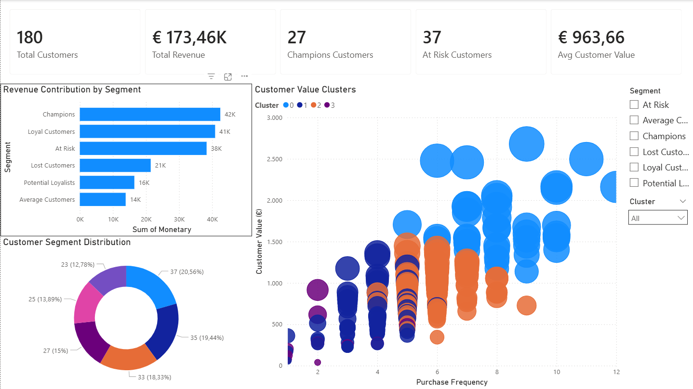
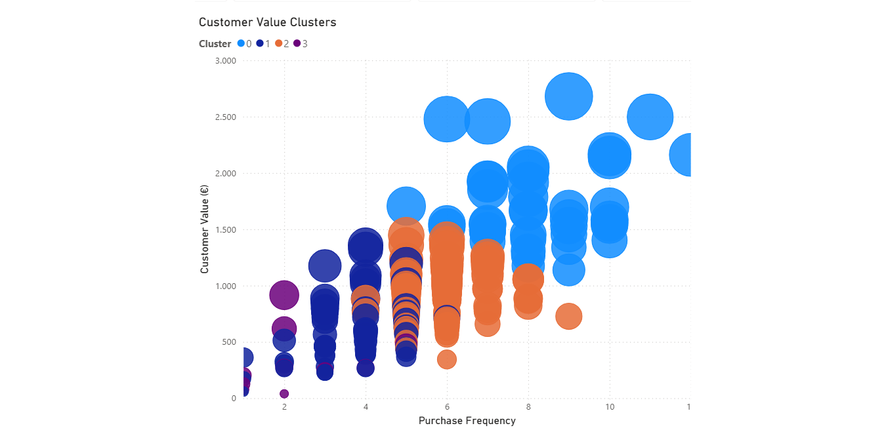
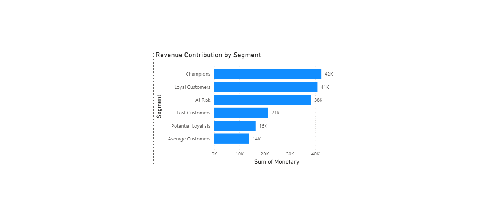

# Customer Segmentation Analysis

Customer segmentation project using RFM analysis, KMeans clustering, Python, and Power BI to identify high-value and at-risk customers based on transactional sales data.

---

# Dashboard Overview



---

# Business Problem

Businesses often struggle to identify:
- high-value customers,
- inactive customers,
- retention opportunities,
- and customer groups with different purchasing behaviors.

This project analyzes customer transactional data to segment customers based on:
- purchase recency,
- purchase frequency,
- and monetary value.

The goal is to support:
- customer retention strategies,
- sales optimization,
- and targeted marketing actions.

---

# Project Objectives

- Perform customer segmentation using RFM analysis
- Identify high-value and at-risk customer groups
- Apply KMeans clustering for behavioral segmentation
- Build an interactive Power BI dashboard
- Generate business insights from customer purchasing behavior

---

# Technologies Used

- Python
- Pandas
- NumPy
- Matplotlib
- Scikit-Learn
- Jupyter Notebook
- Power BI

---

# Methodology

## 1. Data Preparation
- Cleaned transactional sales data
- Converted date fields to datetime format
- Aggregated customer-level metrics

---

## 2. RFM Analysis

RFM metrics used:
- **Recency** → How recently a customer purchased
- **Frequency** → How often a customer purchases
- **Monetary** → Total customer spending

Customers were scored using quintiles to create customer segments such as:
- Champions
- Loyal Customers
- Potential Loyalists
- At Risk
- Lost Customers

---

## 3. KMeans Clustering

KMeans clustering was applied to identify customer behavior groups based on:
- Frequency
- Monetary Value

The clustering process revealed distinct customer profiles:
- high-value frequent buyers,
- medium-value customers,
- low-activity customers,
- and inactive customer groups.

---

# Customer Cluster Visualization



---

# Revenue Contribution by Segment



---

# Key Insights

- Champions generated the highest revenue contribution
- At Risk customers represented a major retention opportunity
- Customer clusters revealed clear purchasing behavior differences
- High-frequency customers contributed disproportionately higher revenue
- Segmentation can support targeted marketing and CRM strategies

---

# Power BI Dashboard Features

- KPI overview cards
- Revenue contribution analysis
- Customer segment distribution
- Interactive slicers
- Customer value clustering visualization

---

# Repository Structure

```text
customer-segmentation-analysis/
│
├── notebook/
├── dashboard/
├── images/
├── data/
└── README.md
```

---

# Files Included

| Folder | Description |
|---|---|
| notebook | Jupyter Notebook with full analysis |
| dashboard | Power BI dashboard (.pbix) |
| images | Dashboard screenshots |
| data | Processed dataset |
| README.md | Project documentation |

---

# Business Value

This project demonstrates how customer analytics can help businesses:
- improve retention,
- identify high-value customers,
- optimize marketing strategies,
- and support data-driven decision-making.

---

The analysis is based on full-year 2025 transactional sales data.

---

# Author

Paschalis Angelopoulos

- LinkedIn: www.linkedin.com/in/paschalis-angelopoulos-lnkdn
- GitHub: https://github.com/pasxalisag
